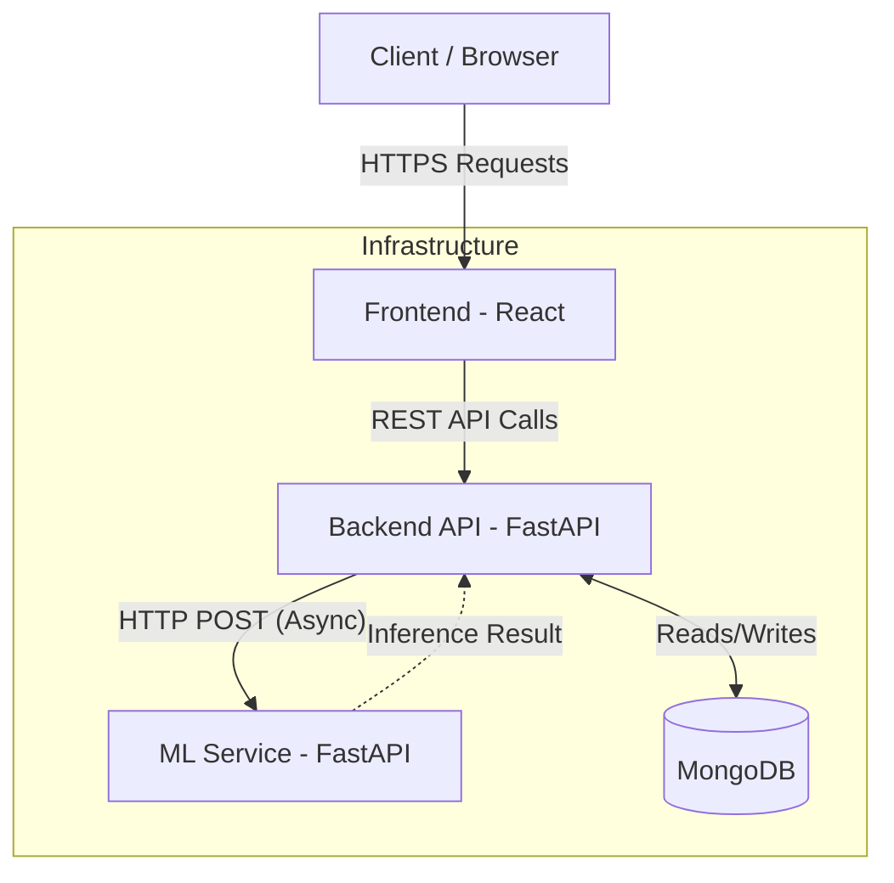

# Architecture

## Overall Architecture
The Smart Government Feedback System follows a **Microservices-oriented / Modular Architecture**, separated into three distinct deployment units: a single-page application frontend, a core backend API, and a dedicated machine learning service. 

This architecture allows the compute-heavy natural language processing tasks to be scaled and deployed independently of the core CRUD and authentication operations.

## Architectural Components

### 1. Frontend (React SPA)
- **Role:** Presentation layer and client-side application.
- **Responsibilities:** Renders the user interface, handles client-side routing, manages local state, and communicates with the Backend API.
- **Location:** `frontend/`

### 2. Backend API (FastAPI)
- **Role:** Core business logic and data persistence layer.
- **Responsibilities:** 
  - Handles authentication and authorization (JWT & CSRF).
  - Manages CRUD operations for Policies, Users, and Comments.
  - Rate limiting (SlowAPI) and validation (Pydantic).
  - Acts as an orchestrator, pushing new comments to the ML Service via HTTP.
- **Location:** `backend/`

### 3. ML Service (FastAPI / Modal)
- **Role:** Dedicated data processing layer.
- **Responsibilities:** 
  - Loads PyTorch/Transformers NLP models into memory.
  - Receives batched text inputs and returns sentiment predictions (`Positive`, `Negative`, `Neutral`).
  - Completely stateless regarding application data.
- **Location:** `ml-service/`

### 4. Database (MongoDB)
- **Role:** Persistence layer.
- **Responsibilities:** Stores all relational entities in a document format.
- **Collections:** `users`, `posts`, `comments`, `pending_users`, `token_blocklist`, `valid_department_ids`.

## Data Flow

## Communication Mechanisms
1. **Frontend to Backend:** Standard synchronous HTTP REST calls. Authentication is handled via `HttpOnly` cookies (Access and Refresh tokens) and a `X-CSRF-Token` header.
2. **Backend to ML Service:** Asynchronous HTTP POST requests using the `httpx` library. The backend utilizes FastAPI's `BackgroundTasks` to avoid blocking the main request thread while waiting for the ML Service.
3. **Backend to Database:** Asynchronous TCP connections using the `motor` driver.

## Important Design Patterns

### 1. Repository / Service Pattern (Backend)
The backend separates routing logic from business logic.
- `routes/` directory handles HTTP request/response parsing and dependency injection.
- `services/` directory contains the actual business logic, database queries, and external API calls (e.g., `post_service.py`, `auth_service.py`).

### 2. Batch Processing (ML Service)
The ML Service implements an asynchronous batching queue (`asyncio.Queue`). Instead of running inference on a single comment immediately, it groups incoming requests (up to a batch size of 32) within a short time window (50ms) to maximize GPU/CPU throughput during inference.

### 3. Asynchronous Non-Blocking I/O
The entire backend stack is built on Python's `asyncio` (FastAPI, Motor, HTTPX). This allows the backend to handle a high volume of concurrent connections efficiently, especially when waiting for database queries or the ML service.
