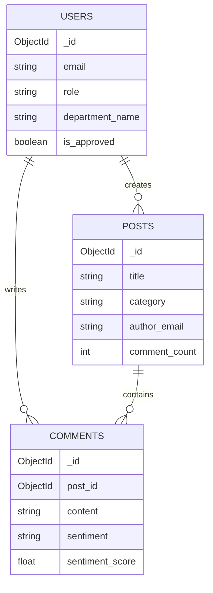

# Database Architecture

The Smart Government Feedback System uses **MongoDB**, a NoSQL document database, allowing for flexible schemas and rapid iteration. The database interactions are handled asynchronously via the `motor` Python driver. 

Schema validation is enforced at the application layer using Pydantic models.

## Database Name
Defined in environment configuration: `smart_gov_feedback` (default).

## Collections

### 1. `users`
Stores all registered user accounts (Public, Government, Admin).
- `_id`: ObjectId
- `email`: String (Unique)
- `hashed_password`: String
- `role`: Enum ("public", "govt", "admin")
- `full_name`: String
- `department_name`: String (Optional, for Govt users)
- `department_id`: String (Optional, for Govt users)
- `is_approved`: Boolean (Govt users require admin approval)

### 2. `posts` (Policies)
Stores the policies created by government officials.
- `_id`: ObjectId
- `title`: String
- `description`: String
- `category`: String (Matches department name)
- `author_email`: String
- `author_role`: String
- `is_active`: Boolean
- `created_at`: DateTime
- `comment_count`: Integer (Denormalized for faster sorting/querying)

### 3. `comments` (Feedback)
Stores public feedback associated with policies. Separating comments into their own collection (rather than embedding them in `posts`) prevents document size limits and allows independent querying and pagination.
- `_id`: ObjectId
- `id`: String (UUID generated at creation)
- `post_id`: ObjectId (Reference to `posts._id`)
- `content`: String
- `author_email`: String
- `author_role`: String
- `sentiment`: String ("pending", "POSITIVE", "NEGATIVE", "NEUTRAL", "failed")
- `sentiment_score`: Float (e.g., 0.985)
- `sentiment_model_version`: String
- `created_at`: DateTime

### 4. `pending_users`
Stores incomplete signups awaiting OTP verification.
- `_id`: ObjectId
- `email`: String (Unique)
- `hashed_otp`: String
- `user_data`: Object (Temporary storage of signup form data)
- `expires_at`: DateTime (TTL index automatically deletes expired documents)
- `attempts`: Integer (Track failed OTP attempts)

### 5. `token_blocklist`
Stores revoked JWT Refresh Tokens (e.g., after logout).
- `_id`: ObjectId
- `jti`: String (Unique JWT ID)
- `revoked_at`: DateTime

### 6. `valid_department_ids`
A configuration collection used to validate `department_id` inputs during Government user registration.
- `_id`: ObjectId
- `department_id`: String
- `department_name`: String

## Entity Relationship Diagram

## Data Access Patterns
- **Pagination:** Implemented using `.skip()` and `.limit()` on database cursors.
- **Aggregation:** Advanced `$facet`, `$group`, and `$match` pipelines are heavily utilized in `analytics_service.py` and `admin_analytics_service.py` to generate dashboard metrics without pulling raw data into application memory.
- **Full-Text Search:** The `posts` collection is queried using MongoDB's `$text` operator for keyword searches, suggesting a text index exists on titles and descriptions.
