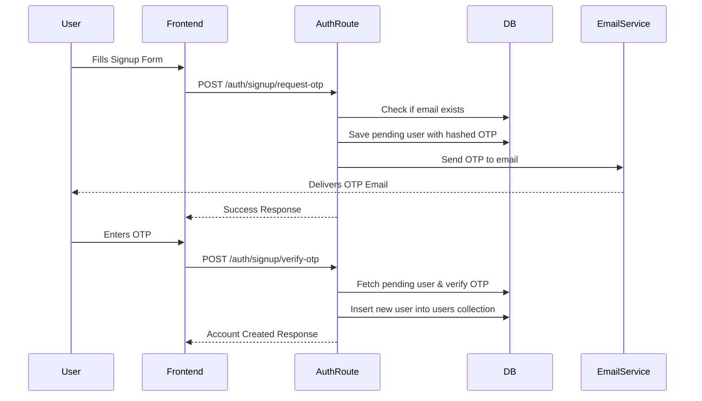
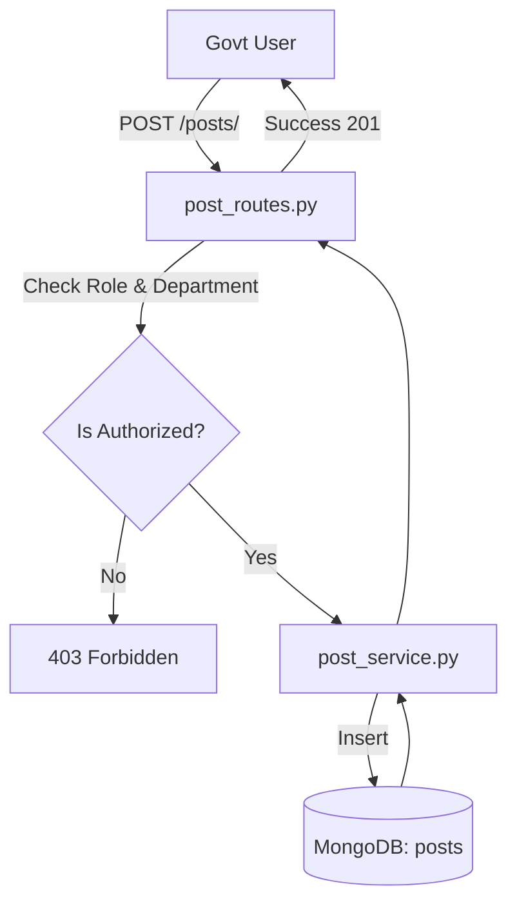
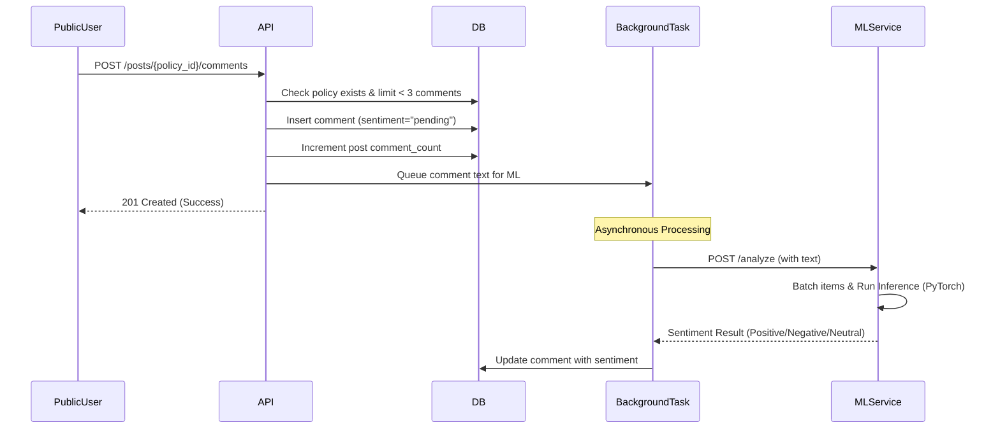

# Functional Workflows

This document outlines the major application workflows implemented in the Smart Government Feedback System.

## 1. User Authentication (Signup via OTP)
**Purpose:** Securely register new Public and Government users using email verification.


**Error Handling:** Invalid OTP attempts are logged, and after 5 failed attempts, the pending user record is deleted to prevent brute-force attacks.

---

## 2. Policy Creation (Government User)
**Purpose:** Allow authorized Government users to publish new policies for their specific department.


**Entry Point:** `backend/routes/post_routes.py -> create_post`
**Validation:** The route verifies that the user is a `govt` user and that the policy's category matches the user's assigned department (unless the user is in the "Central" department).

---

## 3. Feedback Submission and Sentiment Analysis
**Purpose:** Allow the public to comment on policies and automatically evaluate the sentiment of that comment.


**Entry Point:** `backend/routes/post_routes.py -> save_policy_comment`
**Error Handling:** If the ML Service is unreachable or times out, the background task retries with exponential backoff. If all retries fail, the comment's sentiment is updated to `"failed"` in the database.

---

## 4. Admin Analytics Retrieval
**Purpose:** Provide Administrators with aggregated sentiment and policy data.

```text
Admin User
   ↓ (Requests Dashboard Data)
Frontend API Client
   ↓ (GET /admin/analytics/overview)
Admin Analytics Route (admin_analytics_routes.py)
   ↓ (Dependency: RequireRole(["admin"]))
Admin Analytics Service (admin_analytics_service.py)
   ↓ (Aggregation Pipeline)
Database (MongoDB)
   ↓ (Aggregated Results)
Response
```
**Processing Steps:** The backend uses complex MongoDB Aggregation pipelines (`$match`, `$group`, `$facet`) to calculate overall counts, distribution of sentiments, and trends over time directly within the database layer for efficiency.
